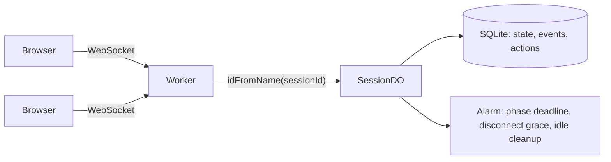

# MeepleSync

A minimalist, text-only realtime room for small groups. Open a room, share the link, and everyone in it shares one live text history. Rooms can also run simple text-based games; rock-paper-scissors is the first one.

No accounts, no installs: the browser keeps a local anonymous identity, and a Cloudflare Durable Object holds the authoritative state of each room.

## Features

- **Anonymous identity**: pick a display name and you're in. Refreshing the page or reconnecting keeps you as the same participant.
- **Rooms with shareable links**: every room has a short ID (`/s/abcd2345`). Join as a player or as an observer.
- **Shared text history**: everyone, including observers, can post text at any time. The last 50 messages are kept and survive refreshes.
- **Rock-paper-scissors mode**: the host picks the mode when creating the room or later in the lobby. A move is just text restricted to `石頭` / `布` / `剪刀`, sent from the same input box; emoji shortcut buttons are provided.
- **Commit-reveal**: a move is hidden behind a SHA-256 commitment until everyone has chosen or time runs out. After the reveal, each browser checks every move against its commitment and marks it `✓`.
- **Phases and timers**: the server drives phases with deadlines. When every required player has acted, the game advances immediately; otherwise it advances on timeout.
- **Resilient connections**: the client reconnects automatically with backoff, replays missed events, and shows who is disconnected. A disconnected participant keeps their seat for 60 seconds.
- **Server authority**: every state change is validated on the server. Retried actions run only once, and actions aimed at an outdated phase are rejected.

The UI is in Traditional Chinese.

## How it works



- **One Durable Object per room** (`SessionDO`). It processes every message one at a time, so it is the single source of truth. It uses WebSocket Hibernation, so idle rooms cost no compute.
- **State is a snapshot plus an event sequence.** Every state change emits events with a contiguous `seq` and appends them to a log, which keeps the last 1000 events.
  - On reconnect, the client sends the last `seq` it saw. The server replays the missing events, or sends a full snapshot if the log no longer covers that range.
  - If the client sees a gap in `seq`, it asks for a resync.
- **Per-viewer projection.** Events and snapshots are filtered for each recipient. For example, a player sees their own hidden move, while everyone else sees only the commitment.
- **Idempotent actions.** Each action carries a client-generated `actionId`, and the server caches each result for an hour.
- **Phase-checked actions.** Each action carries the `phaseId` it targets. Anything aimed at an older phase is rejected with `stale_phase`.
- **One alarm per room.** It is set to the earliest of three times: the phase deadline, a disconnect grace expiry, or the idle-cleanup time. A room with no connections for 30 minutes is deleted.

## Getting started

Requirements: Node.js 24+ and npm 11+.

```bash
npm install
npm run dev
```

The dev server uses **HTTPS with a self-signed certificate**, so you'll need to accept the browser warning the first time. HTTPS matters because `crypto.subtle`, which verifies commitments, only exists in secure contexts.

- Local: `https://localhost:5173/`
- To reach it from other devices on your network, run `npm run dev -- --host 0.0.0.0` and open `https://<your-ip>:5173/`.

npm 11 blocks install scripts by default. The required ones (`workerd`, `esbuild`) are allow-listed in `package.json` under `allowScripts`. If you upgrade `wrangler` or the Vitest pool, approve the new versions with `npm approve-scripts workerd esbuild`.

### Trying it with several people on one machine

Identity lives in `localStorage`, so every tab of the same browser is the **same** participant: opening a second tab takes over from the first. To simulate several people, use any of these:

- different browsers
- a private window
- different origins, for example `https://localhost:5173` and `https://127.0.0.1:5173`

## Scripts

| Command | What it does |
| --- | --- |
| `npm run dev` | Vite dev server with the Worker and Durable Object running locally |
| `npm test` | Vitest suite running inside the Workers runtime |
| `npm run typecheck` | `tsc -b` across client, worker, and tooling configs |
| `npm run build` | Production build into `dist/` |
| `npm run deploy` | Build and `wrangler deploy` (run `npx wrangler login` first) |
| `npm run cf-typegen` | Regenerate `worker-configuration.d.ts` after editing `wrangler.jsonc` |

## Project layout

```text
src/
  shared/              Code used by both client and worker
    protocol.ts        Message, event, action, and view types
    view.ts            applyEvent(): pure reducer the client uses to apply events
    games/rps.ts       Rock-paper-scissors rules, commitment helpers
  worker/
    index.ts           HTTP routes: create room, WebSocket upgrade, debug log
    session.ts         SessionDO: identity, validation, phases, broadcast, alarm
    store.ts           SQLite persistence and per-viewer projection
    config.ts          Timeouts and limits
    games/types.ts     GameModule interface
    games/rps.ts       Rock-paper-scissors game module
  client/
    connection.ts      WebSocket client: reconnect, resync, pending actions
    identity.ts        Anonymous identity in localStorage
    useSession.ts      React hooks for the session and server-synced time
    pages/             Home and Room
    components/        Text history, participant list, phase bar, scoreboard
test/                  Unit and Durable Object integration tests
```

## HTTP and WebSocket API

| Endpoint | Purpose |
| --- | --- |
| `POST /api/sessions` with body `{ "mode": "text" \| "rps" }` | Create a room. Returns `{ sessionId }`. |
| `GET /api/sessions/:id/ws` | WebSocket into the room. |
| `GET /api/sessions/:id/log` | Raw event log, including private data. Only available when `DEBUG=1`. |

WebSocket messages are JSON; `src/shared/protocol.ts` is the full reference.

- **Client to server**:
  - `hello`: identify, and say which `seq` you last saw
  - `action`: an action with its `actionId` and target `phaseId`
  - `sync`: ask for missed events or a snapshot
  - `leave`
- **Server to client**:
  - `sync`: a snapshot and/or replayed events
  - `events`: live events
  - `ack`: the result of an action
  - `error`
- **Heartbeat**: the client sends the literal string `ping`, and the server answers `pong` without waking the Durable Object.

Close codes: `4000` left the room, `4001` replaced by another tab, `4003` rejected, `4404` room not found.

## Configuration

Timeouts and limits are constants in `src/worker/config.ts`:

| Setting | Default |
| --- | --- |
| Time to choose | 20 s |
| Reveal display | 5 s |
| Rounds | 3 (max 10) |
| Disconnect grace | 60 s |
| Idle cleanup | 30 min |
| Event log size | 1000 |
| Players / participants per room | 8 / 32 |

Text limits (200 characters per message, 50 messages kept) are in `src/shared/protocol.ts`.

To enable the debug log endpoint locally, copy `.dev.vars.example` to `.dev.vars`.

## Testing

```bash
npm test
```

Tests run inside the real Workers runtime through `@cloudflare/vitest-pool-workers`. The integration tests open real WebSockets to the Durable Object and cover:

- joining and leaving, host transfer, and identity checks
- idempotent retries and `stale_phase` rejection
- observers being unable to play or see hidden moves
- timeouts and disconnect grace
- idle cleanup
- event replay producing exactly the same view as a fresh snapshot

## Known limitations

- No rate limiting on text messages.
- Room state stored in a Durable Object has no schema migration. Rooms created before a state shape change may break; for now, create a new room.
- Display names can only be changed from the home page. The change is applied on the next connection.
- Old Maid (抽鬼牌) and other games are not implemented yet.
